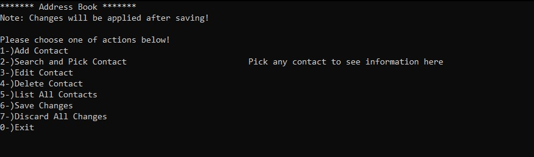
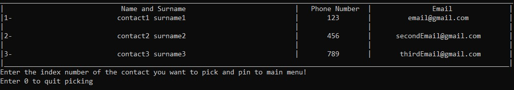
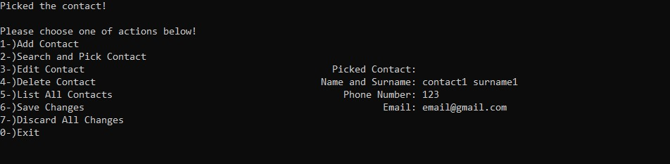

# Address-book
> Simple address book application on command line interface written in C

## Table of Contents
* [General Info](#general-information)
* [Technologies Used](#technologies-used)
* [Features](#features)
* [Screenshots](#screenshots)
* [Setup](#setup)
* [Usage](#usage)
* [Project Status](#project-status)
* [Room for Improvement](#room-for-improvement)
<!-- * [License](#license) -->

## General Information
- Address book app to keep track of saved contacts.
- Provides fast and relevant search algorithms.

## Technologies Used
- Only the built-in C libraries were used.

## Features
- Adding & deleting & editing contacts
- Searching contacts
- Listing all contacts

## Screenshots

## Setup
Requirements: C compiler

- Any C compiler would work but only GCC is tested

Setup:
- Pull the project into a folder and you are done!

Settings:
- Maximum contact count, and string lengths can be adjusted in `./Address-book/src/header/types.h`

## Usage
Change your directory to `/Address-book/src` in cmd. Type this to terminal to compile the project:

`gcc -std=c99 -Wall -Werror -o AddressBook main.c file_operations.c menu.c data_structures/stack.c data_structures/double_linked_list.c book_func/add_del_edit_list.c book_func/init.c book_func/print.c book_func/search.c book_func/discard.c misc/math_func.c misc/string_func.c`

If you did not get any compile errors, you can start the app by typing `./AddressBook` in the terminal.

## Project Status
Project is: _in progress_ <!-- __complete__ once finished-->

## Room for Improvement

Room for improvement:
- Better error handling

To do:
- Ability to import contacts from Android and IOS
- Ability to export contacts to Android and IOS

Known bugs:
- Non-ASCII characters causing contact table to have wrong spacing

<!-- ## License -->
<!-- This project is open source and available under the [... License](). -->
